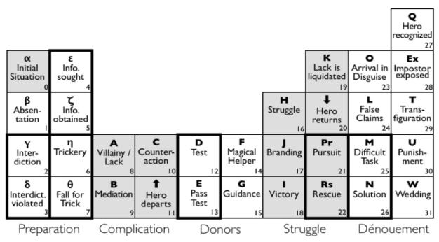
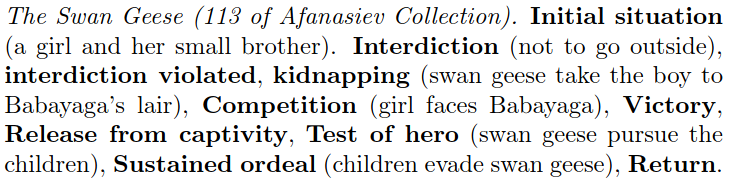

% SEPITIN
% Iikka Hauhio & Petrus Peltola
% 18.11.2020

# Initial idea

- Short stories, roughly 1500-2500 words

- [NaNoGenMo](https://nanogenmo.github.io/) [(2019 entries)](https://github.com/NaNoGenMo/2019/issues?q=label%3Acompleted)

# Narrative generation challenges

- Coherence

- Appeal

# Initial program structure idea

- Twofold design: plot generation & NLG

- Plots are generated using a tree-based approach

- An interpreter writes out the plot as a short story

# Initial plot generation idea

- (Insert picture of example trees)

# Action pairs

# Existing plot generation models

- Many models and purposes, big differences

- Templates, neural nets, tree search

# Propp's morphology

- “Function must be taken as an act of dramatis personae, which is defined from the point of view of it's significance for the course of action of a tale as a whole”

- [31 different functions split into different categories](http://changingminds.org/disciplines/storytelling/plots/propp/propp.htm)

----

# A Case-based reasoning approach (Gervás et al.)

- Memory-based paradigm where an existing library of 'cases' is adapted

- Function substitution may used if applicable

----

----

----

----

# A template-based model (Grasbon et al.)

- An author writes static scenes, which are shown to a player

- The interactive engine picks the most suitable scene based on interaction

----

