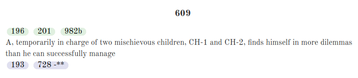
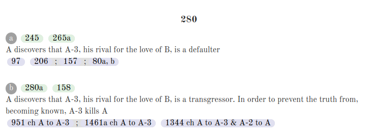

## SEPITIN system description

The project consists of two mostly independent parts: the plot generator and the neaural net. The plot generator was meant to act as a propmt generator for the neural network, but in the current version the neural net does not adapt to the given prompts very well, making the plot generator quite redundant.

### Juono, the plot generator

The plot generator, called Juono, was meant to generate story plots in Finnish using the [Plotto method](http://garykac.github.io/plotto/plotto-mf.html). Plotto has been digitized and can be [found in GitHub](https://github.com/garykac/plotto) thanks to Gary Kacmarcik. Juono also utilizes the very handy Beautiful Soup library for parsing Plotto's HTML.

##### Plotto

Plotto consists of about fifteen hundred story actions, which look something like this: 

The actions consist of an ID, possible sub-IDs, the action description and links to possible lead-in and carry-on actions. These links can have many possible modifications to the linked action, the most common ones being changing or transposing actors (the *ch* and *tr* notations) and selecting only some parts of the description (the *\*-\*\** notation). Juono also supports the multi-part action chain links, where a link consists of multiple sequential actions separated by a semicolon.

How Plotto, and thus Juono, builds plots from these actions is by selecting a midpoint action from a list of possible pre-determined actions and expanding in both directions via the leand-in and carry-on links. Chronolgically the lead-ins are naturally added preceding the first action and the carry-ons succeeding the last one. In the current version of Juono you can generate a lead-in by calling the ´´´Story.generate\_lead\_in(True)´´´ function and a carry-on by calling the ´´´Story.generate\_carry\_on(True)´´´ function. By changing the parameter to False you disable multi-part links, which add multpile actions with one function call.

#### The state of Juono

The current version of Juono is far from perfect, in fact some plot actions and action links are either parsed wrong or expressed in an inconsistent manner. The latter stems from plotto being old (written int the 1920s!) and made for human readers, while the former is just unpolished code. Juono is not as good as it could be due to time constraints and it's incompability with the surface realizing neural net. In the current version there are a few Finnish actions included, but as soon as we tested using them as prompts for the net we saw that this approach wouldn't work with the current version of the neural net. You of course can (and should!) try out the few Finnish actions as prompts for the neural net to see the results for yourself. If you want to see original Plotto english actions just change the line 6 constant to False.

### Language model

We trained a _Transformer XL_ -type language model for the purpose of translating plot actions to Finnish text.
Our initial idea was that given a short summary or other set-up text, the model would write a whole chapter about the action.
To train the model, we used 1,477 Finnish short stories from the [Archive of Our Own](https://www.archiveofourown.org/), a popular fan fiction website.
We used the _Python programming language_ and a library called _fastai_.

It soon became apparent that partly due to the source material and partly due to our lack of time needed for optimizing the training procedure,
the model was only capable of generating a certain type of actions involving describing romantic relationships between characters.
It was especially interested in generating discussions where characters proclaim their love to the other characters.

Due to this, and our lack of time, we couldn't get the model to generate descriptions of plot actions.
However, it can generate grammatically correct Finnish text with the characters introduced in the prompt.
We created a script using the _Raku programming language_, that can generate dialogues using the model.
Below are examples of both raw model output and the dialog generator.

#### Raw model output

The prompt is **bolded**.

Example 1

> **Harry ja Draco keskustelivat** jostain, mistä he eivät olleet kuulleet aikaisemminkaan. Enemmän kuin mistään muusta, sillä Draco ei ollut koskaan ennen ajatellut, ettei hänellä olisi mitään asiaa siihen. Harry oli kuitenkin saanut selville, että Draco voisi jäädä yöksi omaan asuntoonsa. Palatessaan Draco oli ymmärtänyt, ettei tulisi koskaan olemaan. Tällä kertaa hän ei joutuisi jäämään tänne yksin.
>
> Hiljaa Harry riisui vaatteensa ja siirtyi sitten Dracon viereen, suuteli tätä hellästi ja Draco vastasi suudelmaan tyytyväisenä.
>
> "En tiedä", Draco vastasi ja Harry suuteli häntä pehmeästi. "Sinä olet minun", Harry sanoi hiljaa ja kietoi kätensä Dracon ympärille, "mutta tänään minä en tule näkemään sinua enää." "Tiedän. Jos sinä haluat, niin minä voin käydä suihkussa", Draco sanoi hiljaa. "Hyvä on", Harry sanoi ja antoi Dracon valita minkä, sillä tämä ei tahtonut että Draco tahtoisi puhua hänestä. "Minäkin tahdon olla sisällä, minä tarvitsen sitä niin paljon että saan maata tässä omassa sängyssäni ja elää sinun kanssasi. Joten meidän pitää kertoa sinulle jotain."
>
> Draco ei ollut koskaan kokenut mitään vastaavaa kun Harry oli ollut omega ja Draco oli yrittänyt suojella itseään. Harry oli luvannut Dracon huolehtivan kaikesta siitä mitä Draco saisi.
>
> "Minä tarvitsen sinua", Draco sanoi hitaasti ja painoi päänsä vasten Scorpiuksen olkaa. "Minä autan sinua", Harry sanoi ja sulki silmänsä. "Hyvä on, hyvä on", Draco sanoi ja painoi huulensa Harryn niskaan.
>
> He eivät olleet puhuneet asiasta pitkään aikaan, mutta Draco arveli että Harry tulisi pian Scorpius Dracon raskaaksi. Tämä oli edelleen alfa, ja Scorpius oli valmis ottamaan mitä tahdoin, sillä hän ei voisi koskaan päästää omegaa kosketuksistaan näin epävarmaksi.
>
> Joten jos he haluaisivat tehdä tämän nyt, niin Scorpius olisi valmis tähän. Niinpä hän otti ensimmäisen kerran vastaan mitä omega oli tehnyt tälle ja vaati tätä alfaansa ottamaan hänet. Draco toivoi, että voisivat tehdä toisen omegalle, sillä hän toivoi että voisi tuntea omegansa uudelleen sisäänsä. Scorpius olisi ollut valmis tähän vaikka tällä kertaa alfa ja Draco ymmärsi, ettei ollut koskaan merkinnyt Harrylle mitään.
>
> En Scorpius ei halunnut että omega saavuttaisi alfan tyydytystä alfalla ja alfalla oli joitain omega alfan tarpeita alfa alfa alistu omega pystyi tyydyttämään alfan tarpeet. Dracon tyydytus oli se mitä Scorpius tarvitsi, hän oli alfa. omega ei ollut koskaan sitoutunut omega omegaan, alfa oli alfa ja siksi heidän täytyisi tehdä näin. Scorpius olisi valmis tekemään mitä Scorpiuksen, omega, saavutta ja kestävä alfa alfa omega hänen alfalleen.

Example 2

> **Harry aikoi tappaa Dracon**, mutta Dracon vaistomainen ääni pakotti hänet katsomaan tätä silmiin. "Sinä olet minun alfani", Draco sanoi hiljaa. "Olen minä, sillä olin todella heikko ja kunnioitettu", Harry kuiskasi hiljaa. "Minä en ollut tyhmä, minä olin vahvempi kuin sinä. Olin sankari ja minä olin, minä olin se joka ratkaisi oikeuden. Mutta sinä et olisi voinut toimia toisin. Sinun olisi voinut olla tukenasi, ja kaikesta huolimatta sinä olisit aiheuttanut itsellesi pahoja miehiä ja muita, jotka olivat saaneet sinut. Ja jos olisit antanut jotain, niin olisin tullut itse, olisin ollut iloinen nähdessään sinun reaktiosi. Mutta Draco ei voinut kertoa sinulle mitä olet koskaan sanonut minulle.
>
> Pidätkö sinä minusta?" Harry ojensi kätensä Dracolle ja puristi hellästi tämän taikasauvaa. "En ole koskaan pyytänyt anteeksi, en missään nimessä. Minä haluan vain olla sinun tukenasi, enkä sinä tarkoittanut sitä." "Minä en ymmärrä", Draco sanoi viha äänessään. "Minä olen ollut kanssasi samaa mieltä silloin kun olit vasta pieni, enkä minä tiedä kuinka monta olisi halunnut, mutta pakotin sinua siihen. Paljon aseen, niin sinun ei olisi pitänyt päästää minua pois luotasi. En voi antaa anteeksi hänelle, mutta minä olen todella pahoillani siitä kaikesta mitä tapahtui. Sinä olet minun ainoa mahdollisuutenini on, ettei hän voi tehdä mitään puolestasi. Siitä huolimatta minä olen saanut selityksen sinulle ja Dracolle. Sinä olet minun isäni, etkä sinä voi olla hänen rinnallaan.

Example 3

> **Draco aikoi nolata Harryn tämän tyttöystävän Ginnyn edessä.** ”Minä en ole koskaan –”, Draco aloitti, mutta Harry keskeytti hänet. ”Ei ole minun asiani puhua sinulle nyt kun olen tehnyt kaiken aikaa, niin sinun ei tarvitse puhua minulle siitä. Sinun täytyy vain sanoa, että minä olen itse asiassa ollut ihastunut sinuun koulussa. En voi kieltää, että olisin tiennyt sinusta mitään, joten minä en oikeastaan tiedä milloin sinä olet –” ”No mutta Draco, tämä on aina jotain”, Harry keskeytti Dracon ja kääntyi katsomaan Dracoa. ”Minä aion tätä.” ”Minä olen ihan helvetin pahoillani”, Draco sanoi ja katsoi häntä silmät kapeina. ”En minä tarkoittanut sitä.” ”Ei se mitään”, hän sanoi ja mietti, miten ihmeessä oli mahdollista ettei Draco ollut huomannut sitä. ”Ehkä... ehkä sinun pitäisi kertoa. En missään tapauksessa halua kertoa. En pysty siihen.” ”Sinä et voi uskoa sitä”, Draco sanoi ja vilkaisi häntä, ”hemmetti, minä olen todella –” ”Niin”, hän sanoi ja painoi suunsa kiinni. Draco tuijotti häntä silmät suurina ja suu raollaan, ja hän mietti hajamielisesti että Draco tuijotti edelleen Dracon suuta, ja sitä paitsi hänellä oli ollut vähän kummallinen olo, ja Draco luultavasti inhosi häntä. ”Tiedän.” ”Tiedän”, Draco sanoi, ”mutta en tiedä vielä.” ”Oletko mustasukkainen? Miksi et halua mennä treffeille kenenkään kanssa?” ”En tiedä”, hän sanoi. ”En minäkään ole rakastunut sinuun.” Draco puraisi alahuultaan. Harry oli tosiaan sanonut hänelle että Draco voisi... mutta ei hän ollut tarkoittanut sitä niin.

#### Dialog generator output

Example 1

> Harry: Me emme voi odottaa iltaa.
>
> Draco: Sinä et voi odottaa sinua. Tiedän, että olet liian kohtelias ja ovellesi taltutetaan, mutta minä en pidä siitä, että sinut palkattiin. Se ei ole minun enoni, hän sanoi nopeasti, että minulla on jo sinulle asiaa
>
> Harry: Kiitos.
>
> Draco: Ei tässä mitään.
>
> Harry: No, katsotaan, jos me jatkamme tästä.
>
> Draco: Hyvä on, puhun hänelle. Nähdään siellä.
>
> Harry: Menen sitten
>
> Draco: Menen nyt nyt vielä monta kertaa avaamaan oven. Katson, että soitat minulle heti kun olet perillä.
>
> Harry: Hyvää uutta joulua
>
> Draco: Olen loistava tyyppi. Nähdään huomenna, olen vielä töissä.

Example 2

> Sherlock: Onko sinulla jotain asiaa?
>
> John: Olen pahoillani. Minä... minä... en ollut tarpeeksi... en ollut tarpeeksi... tosi varovainen. En ole koskaan... br
>
> Sherlock: Olen todella pahoillani, mutta tiedän, että minun olisi pitänyt sanoa aiemmin. Mutta en enää... Anteeksi, anteeksi. Anteeksi
>
> John: Anteeksi, anteeksi. Olen pahoillani.
>
> Sherlock: Moriarty, en tarkoittanut sitä.
>
> John: Tiedän, tiedän, mutta en minä ole vihainen, koska Sherlock kertoo, koska hän on...
>
> Sherlock: Minä vain. Miksi ihmeessä, Sherlock? Miksi sinä et kertonut minulle?
>
> John: En... En... en vaan ollut paikalla, sinun ja Johnin suhteessa. Sain sen anteeksi. Ole kiltti.
>
> Sherlock: Tiedät sen. Minusta tuntuu, etten enää ymmärrä. Et halunnut. En minäkään. Mutta se ei ollut sellaista. Minun olisi pitänyt kertoa, mutta... minun oli pitänyt kertoa, mutta... se vain... anteeksi. En tarkoittanut...
>
> John: Tiedän. Olen pahoillani.

### Some finishing thoughts & ideas

While the project has it's flaws, we had fun building it. If we had more time we think we could dramatically improve the surface realizer by scraping the Finnish fan fiction forum [FinFanFun](https://www.finfanfun.fi/), which has approximately 10-15 times more stories than our current net had. This would of course be a time-consuming undertaking, since scraping the stories would be tricky  in addition to the time and computing power required to train the net. With better surface realization the plot generator could play a bigger role in the produced stories since a larger model should be better at generalizing.
