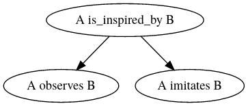
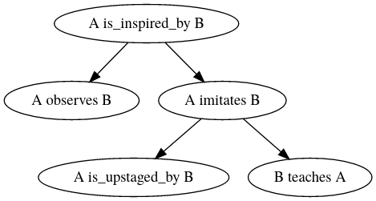

# SEPITIN

Iikka Hauhio & Petrus Peltola 2020

## Introduction

Our project aims to generate creative, coherent and compelling short stories. We got the idea from theNational Novel Generation Month, a popular spin-off to theNational Novel Writing Monthwhere the objective is to write a 50,000 words long piece of fiction in the month of November. When taking a closer look at the NaNoGenMo submissions, two things become apparent: they often lack narrative coherence and the content rarely captivates  the  reader. Both of these problems get worse when the length of the content grows, which is easy to notice when comparing shorter generated texts with the NaNoGenMo entries.

To tackle these issues we planned a twofold approach where we would first generate a plot and then translate the plot into natural language separately. We hope that by using this approach we can focus on the aforementioned issues separately: a good plot keeps the story coherent and better surface realization makes the content more engaging. Thus, our system consists of two parts: the plot generation and the realization of the story as natural language.
These two steps are somewhat separate, so we will describe them individually.

## Plot generation

### Initial idea

The initial idea for generating story plots is to model them as trees of story actions. A story action is a predefined event that takes place between two actors (i.e. the characters of the story), such as ```A is_upstaged_by B``` where A and B are the actors. Tony Veale has made a [large database](https://github.com/prosecconetwork/Scealextric/blob/master/Veale's%20action%20pairs.xlsx) of story actions we can utilize for this. Our trees could be something like this:



Here the root node has a preceding and a succeeding node, which are taken from the defined possible story actions. The idea is that we could 'deepen' the tree by generating more nodes to expand the story like this:



This tree would be traversed inorder and thus producing a chain of events, which would be the final plot sequence.


### Other concerns

It is clear that the initial idea isn't enough by itself. The plot actions always include two characters, and if we were to just generate a tree as shown we would always only have two characters in our story. One way to solve this could be to define some plot actions to make new characters to the tree when 'deepening' the tree, for example ```A kills B``` could be defined to have a possible 'deepening' outcome of ```A hires C``` & ```C kills B```.

Another problem is that just randomly generating more actions based on possible defined outcomes can lead to uncharacteristic actions. We have thought about defining different character archetypes that would have different probablity distributions when determining ways to resolve actions (i. e. deepening the tree). Separate charater generation and/or template definition is something we are interested in but have not yet planned out.

### A word on evaluation

We'd like to have an evaluation function for plots. We could perhaps evaluate how dramatic plots are based on which actions it contains. Another function could take a look at how many characters are in the story and how much they interact with each other, aiming to make the stories have less irrelevant side characters. Plot evaluation is something we have only theorized about yet, but we'll probably implement many evaluation functions and make the final evaluation score a linear combination of all the sensible functions.

## Natural language generation

After generating the story actions, we first translate them to an initial natural language representation using a template-based system. There is a human-written template for each story action into details like character names are inserted. This will result in a natural languge skeleton of the story.

Then, we use Transformer-based neural network to generate a longer text piece for each story action. The template-based text is used as a prompt for the neural network. We are currently training two transformer models, one based on publicly available news articles and one based on fanfiction short stories. We will test both models and select one that generates more compelling results.

The final product will then be either a series of short stories, a series of news articles, or a mixture of both. The generated articles will be independent, but our hope is that they will tell the story we want together.
